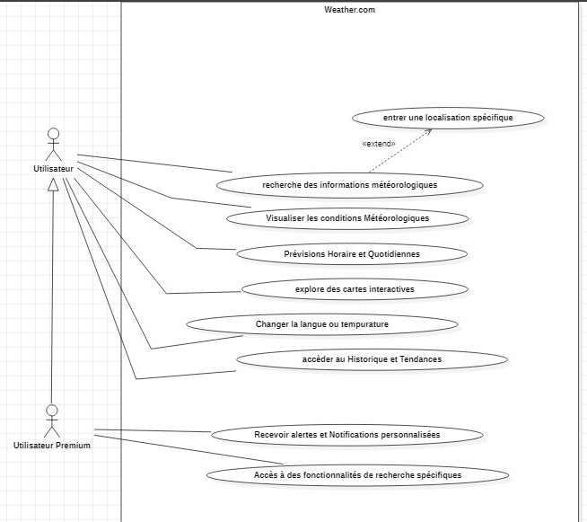
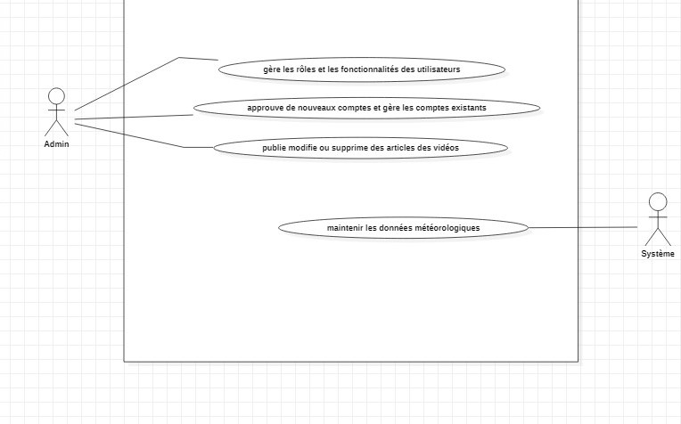
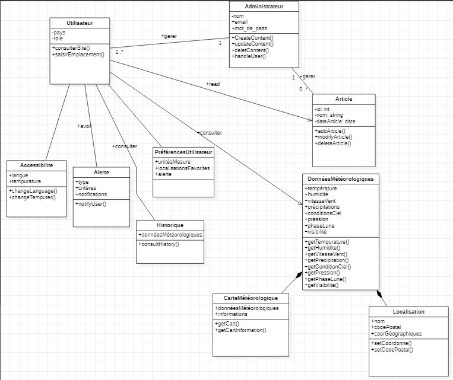
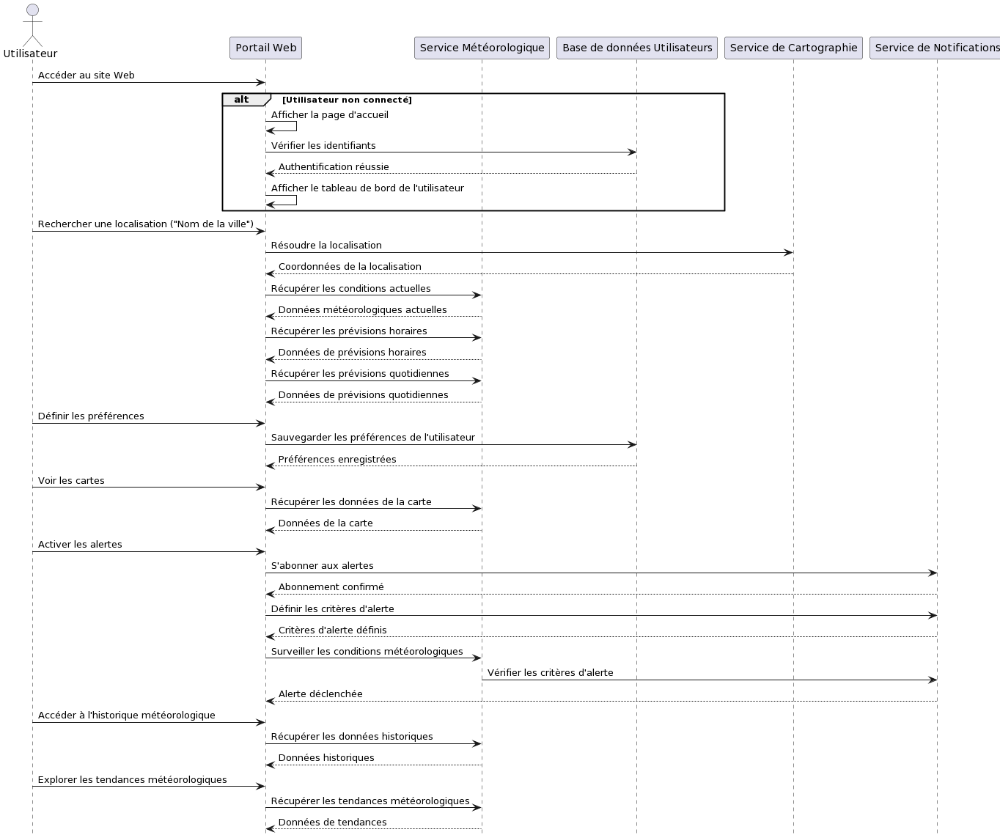

 

  

   <h3 align="center">Weather Diagrams</h3>

  

    Un projet  sur les diagrammes Weather !
     
    <a href="https://github.com/HAMZAELALOUI/Weather"><strong>Explorer les documents »</strong></a>
     
     
  

  
Table des matières

  <ol>
    <li>
      <a href="#about-the-project">À propos du projet</a>
      <ul>
        <li><a href="#Use case diagram">Diagramme de cas d'utilisation</a></li>
        <li><a href="#Class diagram">Diagramme de classes</a></li>
        <li><a href="#Sequence diagram">Diagramme de sequence</a></li>
      </ul>
    </li>
    <li>
      <a href="#Conclusion">Conclusion</a>
      </li>
      <li>
      <a href="#Contributers">Contributeurs</a>
      </li>
    </ol>

## À propos du projet

Le projet vise à créer un portail d'informations météorologiques complet basé sur le modèle de Weather.com, offrant une gamme variée de fonctionnalités et d'informations météorologiques pour les utilisateurs, tout en fournissant une expérience utilisateur enrichissante.

## Diagramme de cas d'utilisation

*Le diagramme de cas d'utilisation illustre les interactions entre les acteurs et le système du portail d'informations météorologiques inspiré de Weather.com. Il met en lumière des fonctionnalités essentielles telles que la recherche d'informations météorologiques, la gestion des préférences utilisateur, l'accès à des cartes interactives, la configuration d'alertes personnalisées, et l'exploration des données historiques. Ces scénarios d'utilisation décrivent comment les utilisateurs interagissent avec le système pour obtenir des informations météorologiques complètes et personnalisées.

## Diagramme de classes

*Le diagramme de classe offre une représentation visuelle de la structure statique du projet de portail d'informations météorologiques, inspiré de Weather.com. En mettant en évidence les classes et leurs relations, ce diagramme offre une vue d'ensemble des entités clés du système, telles que les utilisateurs, les données météorologiques, les préférences utilisateur, les alertes, les cartes météorologiques, et bien d'autres. Ces classes interagissent pour former un écosystème cohérent permettant la gestion efficace des fonctionnalités météorologiques avancées et une expérience utilisateur enrichissante.

## Diagramme de sequence

* Le diagramme de séquence capture de manière séquentielle et chronologique les interactions dynamiques entre les différents acteurs et composants du projet de portail d'informations météorologiques, s'inspirant du modèle de Weather.com. En se concentrant sur des scénarios spécifiques, il met en évidence le flux des messages et des actions entre l'utilisateur, le système, et d'autres entités, offrant ainsi une compréhension détaillée du comportement opérationnel du système, notamment la recherche d'informations météorologiques, la configuration des préférences utilisateur, et la réception d'alertes météorologiques personnalisées.

## Conclusion

En conclusion, les diagrammes de cas d'utilisation, de classe et de séquence offrent une représentation complète et détaillée du projet de portail d'informations météorologiques. Ils facilitent la compréhension des interactions entre les utilisateurs et le système, la structure statique des composants, ainsi que le déroulement séquentiel des scénarios opérationnels. Ces outils visuels jouent un rôle essentiel dans la conception, la communication et la compréhension des fonctionnalités, contribuant ainsi à la réalisation d'un portail météorologique robuste et convivial, conforme aux exigences du cahier des charges initial.

